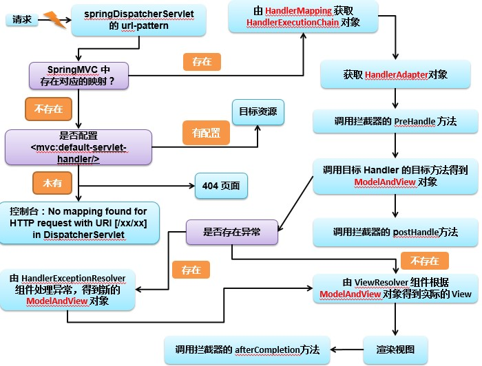

# SpringMVC
## SpringMVC的搭建过程
1. 导入JAR
2. 在web.xml中配置springMVC的核心(前端)控制器DispatcherServlet
   作用：**加载SpringMVC的配置文件**在下方的配置方式下：DispatcherServlet会自动加载配置文件，此时的配置文件有默认的位置和名称
     - 默认位置：web-INF下 
     - 默认名称：dispatcher-servlet.xml  与  &lt;servlet-name&gt;的值有关  
    当加载了配置文件，SprinngMVC就会根据扫描组件找到控制层

````java
   <servlet>
        <servlet-name>dispatcher</servlet-name>
        <servlet-class>org.springframework.web.servlet.DispatcherServlet</servlet-class>
        <load-on-startup>1</load-on-startup>
    </servlet>
    <servlet-mapping>
        <servlet-name>dispatcher</servlet-name>
        <url-pattern>/</url-pattern>
    </servlet-mapping>
````
3. 创建一个POJO，在此类上加上@Controller注解，springMVC就会将此类作为控制层加载，让其处理请求响应
4. 在控制层中，需要在方法上设置注解@RequestMapping(value=""),SpringMVC就是通过此注解将请求路径与控制层中的方法进行匹配。此时请求路径为：localhost:8088/projectName/xxx
5. 处理请求的方法会返回一个字符串，即视图平成，最终会通过配置文件中配置的视图解析器实现页面的跳转  
   方式：将prefix+视图名称+suffix，此为最终跳转的页面路径


## @RequestMapping注解
1. SpringMVC使用@RequestMapping注解为控制器指定可以处理哪些 URL 请求
2. 在控制器的类定义及方法定义处都可标注 @RequestMapping
   - 标记在类上：提供初步的请求映射信息。相对于  WEB 应用的根目录
   - 标记在方法上：提供进一步的细分映射信息。相对于标记在类上的 URL。
   - 若类和方法上都有，应该一层一层的访问，先访问类，再访问类种的方法
3. 若类上未标注 @RequestMapping，则方法处标记的 URL 相对于 WEB 应用的根目录
4. 作用：DispatcherServlet 截获请求后，就通过控制器上 @RequestMapping 提供的映射信息确定请求所对应的处理方法。 

### @RequestMapping的参数
-  method用来设置请求方式，只有客户端发送请求的方式和method的值一致才能处理请求
    - 请求方式：GET 查询,POST 添加,PUT 修改,DELETE 删除
- params:用来设置客户端传到服务器的数据，支持表达式
- username 请求要包含username !username 请求不能包含username username=admin username!=admin
- headers 用来设置请求头信息，所发送的请求的请求头信息一定要和headers属性中所设置的一致

### RequestMapping支持Ant 路径风格
 Ant 风格资源地址支持 3 种匹配符：
       1. ?：匹配文件名中的一个字符
       2. *：匹配文件名中的任意字符
       3. **：** 匹配多层路径

### RequestMapping映射请求占位符PathVariable注解

通过 @PathVariable 可以将 URL 中占位符参数绑定到控制器处理方法的入参中：**URL 中的 {xxx} 占位符可以通过 @PathVariable("xxx") 绑定到操作方法的入参中。**

## REST

### REST是什么
1. REST：即 Representational State Transfer。（资源）表现层状态转化。是目前最流行的一种互联网软件架构。它结构清晰、符合标准、易于理解、扩展方便，所以正得到越来越多网站的采用。
   1. 资源（Resources）：网络上的一个实体，或者说是网络上的一个具体信息。它可以是一段文本、一张图片、一首歌曲、一种服务，总之就是一个具体的存在。可以用一个URI（统一资源定位符）指向它，每种资源对应一个特定的 URI 。获取这个资源，访问它的URI就可以，因此 URI 即为每一个资源的独一无二的识别符。
   2. 表现层（Representation）：把资源具体呈现出来的形式，叫做它的表现层（Representation）。比如，文本可以用 txt 格式表现，也可以用 HTML 格式、XML 格式、JSON 格式表现，甚至可以采用二进制格式。
   3. 状态转化（State Transfer）：每发出一个请求，就代表了客户端和服务器的一次交互过程。HTTP协议，是一个无状态协议，即所有的状态都保存在服务器端。因此，如果客户端想要操作服务器，必须通过某种手段，让服务器端发生“状态转化”（State Transfer）而这种转化是建立在表现层之上的，所以就是 “表现层状态转化”
   4. ④	具体说，就是 HTTP 协议里面，四个表示操作方式的动词：GET、POST、PUT、DELETE。它们分别对应四种基本操作：GET 用来获取资源，POST 用来新建资源，PUT 用来更新资源，DELETE 用来删除资源。
2. HiddenHttpMethodFilter 浏览器 form 表单只支持 GET 与 POST 请求，而DELETE、PUT 等 method 并不支持，Spring3.0 添加了一个过滤器，可以将这些请求转换为标准的 http 方法，使得支持 GET、POST、PUT 与 DELETE 请求

3. 通过过滤器配置
   ````java
    <filter>
        <filter-name>HiddenHttpMethodFilter</filter-name>
        <filter-class>org.springframework.web.filter.HiddenHttpMethodFilter</filter-class>
    </filter>
    <filter-mapping>
        <filter-name>HiddenHttpMethodFilter</filter-name>
        <url-pattern>/*</url-pattern>
    </filter-mapping>
    ````
````java
@Controller
public class RESTController {

    @RequestMapping(value = "/testREST/{id}",method = RequestMethod.GET)
    public String getUserById(@PathVariable("id")Integer id){
        System.out.println("GET:ID="+id);
        return "success";
    }

    @RequestMapping(value = "/testREST",method = RequestMethod.POST)
    public String insertUser(){
        System.out.println("POST");
        return "success";
    }

    @RequestMapping(value = "/testREST",method = RequestMethod.PUT)
    public String updateUser(){
        System.out.println("PUT");
        return "success";
    }

    @RequestMapping(value = "/testREST/{id}",method = RequestMethod.DELETE)
    public String updateUse11r(@PathVariable("id")Integer id){
        System.out.println("delete:id="+id);
        return "success";
    }

    @RequestMapping(value = "/testAjax_DELETE",method = RequestMethod.DELETE)
    public void testAjax_DELETE(Integer id){
        System.out.println("testAjax_DELETE,id="+id);
    }

````
### @RequestParam注解 

1. 在处理方法入参处使用 @RequestParam 可以把请求参数传递给请求方法
2. value：参数名
3. required：是否必须。默认为 true, 表示请求参数中必须包含对应的参数，若不存在，将抛出异常
4. defaultValue: 默认值，当没有传递参数时使用该值
````java
@RequestParam(value="age",required=false,defaultValue="0") int age){
````
### @RequestHeader 注解
1. 使用 @RequestHeader 绑定请求报头的属性值
2. 请求头包含了若干个属性，服务器可据此获知客户端的信息，通过 @RequestHeader 即可将请求头中的属性值绑定到处理方法的入参中 
``public String testRequestHeader(@RequestHeader(value="Accept-Language") String al){``

### CookieValue
1. 使用 @CookieValue 绑定请求中的 Cookie 值
2. @CookieValue 可让处理方法入参绑定某个 Cookie 值
``public String testCookieValue(@CookieValue("JSESSIONID") String sessionId) {``

## 使用POJO作为参数
1. 使用 POJO 对象绑定请求参数值
2. Spring MVC 会按请求参数名和 POJO 属性名进行自动匹配，自动为该对象填充属性值。支持级联属性。如：dept.deptId、dept.address.tel 等

## 中文乱码的解决
**如果中文有乱码，需要配置字符编码过滤器，且配置其他过滤器之前，
如（HiddenHttpMethodFilter），否则不起作用。**
````java
<!-- 配置字符集 -->
	<filter>
		<filter-name>encodingFilter</filter-name>
		<filter-class>org.springframework.web.filter.CharacterEncodingFilter</filter-class>
		<init-param>
			<param-name>encoding</param-name>
			<param-value>UTF-8</param-value>
		</init-param>
		<init-param>
			<param-name>forceEncoding</param-name>
			<param-value>true</param-value>
		</init-param>
	</filter>
	<filter-mapping>
		<filter-name>encodingFilter</filter-name>
		<url-pattern>/*</url-pattern>
	</filter-mapping>

````

## 处理响应数据
#### pringMVC处理请求往作用域中放值有以下3种方式
1. ````java
   @RequestMapping(value = "/param",method = RequestMethod.POST)
    public ModelAndView param(){
        ModelAndView mav=new ModelAndView();
        mav.addObject("username","root");//往作用域中放值
        mav.setViewName("success");//设置视图名称，实现页面跳转
        return mav;
    }


2. ````java 
   @RequestMapping(value = "/param",method = RequestMethod.POST)
    public String param(Map<String,Object> map){
        map.put("username","admin");//向作用域中放值
        map.put("password","aaaaa");
        return "success";//返回视图名称
    }

3. ````java 
   @RequestMapping(value = "/param",method = RequestMethod.POST)
    public String param(Model model){
         model.addAttribute("username","张三");
         model.addAttribute("password","123456");
        return "success";//返回视图名称
    }


总结：**根据modelAndView源码调试 不管使用以上哪种方式最终都会把Model数据和View封装到一个ModelAndView中**

### springMVC设置配置文件的位置和名称
````java
   <servlet>
        <servlet-name>DispatcherServlet</servlet-name>
        <servlet-class>org.springframework.web.servlet.DispatcherServlet</servlet-class>
        <init-param>
            <param-name>contextConfigLocation</param-name>
            <param-value>classpath:conf/springMVC.xml</param-value>
        </init-param>
        <load-on-startup>1</load-on-startup>
    </servlet>
    <servlet-mapping>
        <servlet-name>DispatcherServlet</servlet-name>
        <url-pattern>/</url-pattern>
    </servlet-mapping>
````

### 编码过滤器
**必须放在所有过滤器的最前面**
````java
 <filter>
        <filter-name>CharacterEncodingFilter</filter-name>
        <filter-class>org.springframework.web.filter.CharacterEncodingFilter</filter-class>
        <init-param>
            <param-name>encoding</param-name>
            <param-value>UTF-8</param-value>
        </init-param>
    </filter>
    <filter-mapping>
        <filter-name>CharacterEncodingFilter</filter-name>
        <url-pattern>/*</url-pattern>
    </filter-mapping>
````

## 处理Json
#### JSON知识：
1. JSON有两种格式
     1. Json对象：{key:value,}
     2. (2)	Json数组：[value1,value2…]
2. Json对象的解析方式:对象.key;Json数组的解析方式：for循环遍历
3. Java对象转换Json
     1. Bean和map->Json
     2. List->Json数组 
   
## HttpMessageConverter
1. 	使用HttpMessageConverter<T> 将请求信息转化并绑定到处理方法的入参中或将响应结果转为对应类型的响应信息，Spring 提供了两种途径：
     - 使用 @RequestBody / @ResponseBody 对处理方法进行标注
     - 使用 HttpEntity<T> / ResponseEntity<T> 作为处理方法的入参或返回值
2. 当控制器处理方法使用到 @RequestBody/@ResponseBody 或
 HttpEntity<T>/ResponseEntity<T> 时, Spring 首先根据请求头或响应头的 Accept 属性选择匹配的 HttpMessageConverter,  进而根据参数类型或泛型类型的过滤得到匹配的 HttpMessageConverter, 若找不到可用的 HttpMessageConverter 将报错
3. @RequestBody 和 @ResponseBody 不需要成对出现
4. Content-Disposition：attachment; filename=abc.pdf

## 文件下载
````java
    @RequestMapping("/down")
    public ResponseEntity<byte[]>down(HttpSession session) throws IOException {

        //获取下载文件的路径
        String realPath = session.getServletContext().getRealPath("img");
        String finalPath=realPath+ File.separator+"sea.png";
        System.out.println(finalPath);
        InputStream is=new FileInputStream(finalPath);
        //available获取输入流所读取的文件的最大字节数
        byte[] b=new byte[is.available()];
        is.read(b);
        //设置请求头
        HttpHeaders headers=new HttpHeaders();
        headers.add("Content-Disposition","attachment;filename=zzz.png");
        //设置响应状态
        HttpStatus httpStatus = HttpStatus.OK;
        ResponseEntity<byte[]> entity=new ResponseEntity<byte[]>(b,headers,httpStatus);

        return entity;
    }
````

### 文件上传
1. Spring MVC 为文件上传提供了直接的支持，这种支持是通过即插即用的 MultipartResolver 实现的。 
2. Spring 用 Jakarta Commons FileUpload 技术实现了一个 MultipartResolver 实现类：CommonsMultipartResolver   
3. Spring MVC 上下文中默认没有装配 MultipartResovler，因此默认情况下不能处理文件的上传工作，如果想使用 Spring 的文件上传功能，需现在上下文中配置 MultipartResolver

#### 配置MultipartResolver
defaultEncoding: 必须和用户 JSP 的 pageEncoding 属性一致，以便正确解析表单的内容,为了让CommonsMultipartResolver 正确工作，必须先将 Jakarta Commons FileUpload 及 Jakarta Commons io 的类包添加到类路径下。
````java
<!--处理文件将客户端上传的file文件，处理为MulipartFile文件
    注意：文件解析器的bean中id必须设置为multipartResolver
    -->
    <bean id="multipartResolver" class="org.springframework.web.multipart.commons.CommonsMultipartResolver">
        <!--设置文件解析的编码，注意一定要和页面的pageencoding保持一致-->
        <property name="defaultEncoding" value="UTF-8"></property>
        <!--设置最大上传文件大小-->
        <property name="maxUploadSize" value="8888888"></property>
    </bean>
````

````java
@RequestMapping(value = "up",method = RequestMethod.POST)
    public String up(String desc, MultipartFile uploadFile,HttpSession session) throws IOException {
        //获取上传文件的名称
        String filename = uploadFile.getOriginalFilename();
        String finalFilename = UUID.randomUUID()+filename.substring(filename.lastIndexOf("."));
        String path=session.getServletContext().getRealPath("photo")+File.separator+finalFilename;
        File file=new File(path);
        uploadFile.transferTo(file);
        return "success";
    }
````
## 拦截器
### 自定义拦截器概述
1. Spring MVC也可以使用拦截器对请求进行拦截处理，用户可以自定义拦截器来实现特定的功能，自定义的拦截器可以实现HandlerInterceptor接口，也可以继承HandlerInterceptorAdapter 适配器类  
     1. preHandle()：这个方法在业务处理器处理请求之前被调用，在该方法中对用户请求 request 进行处理。如果程序员决定该拦截器对请求进行拦截处理后还要调用其他的拦截器，或者是业务处理器去进行处理，则返回true；如果程序员决定不需要再调用其他的组件去处理请求，则返回false。
     2. postHandle()：这个方法在业务处理器处理完请求后，但是DispatcherServlet 向客户端返回响应前被调用，在该方法中对用户请求request进行处理。
     3. afterCompletion()：这个方法在 DispatcherServlet 完全处理完请求后被调用，可以在该方法中进行一些资源清理的操作。
2. 配置拦截器
````java
 <mvc:interceptors>
        <!--默认拦截所有请求-->
        <bean class="com.lxy.interceptor.FirstInterceptor"></bean>
        <bean class="com.lxy.interceptor.SecondInterceptor"></bean>
        <!--此方式要求拦截器类上必须加注解@Component-->
<!--        <ref bean="firstInterceptor"></ref>-->
        <!--设置自定义拦截方式-->
 <!--       <mvc:interceptor>
            <bean></bean>
            <mvc:mapping path=""/>
            <mvc:exclude-mapping path=""/>
        </mvc:interceptor>-->
    </mvc:interceptors>
````


#### 当有多个拦截器时
1. preHandle：按照拦截器数组的正向顺序执行
2. postHandle：按照拦截器数组的反向顺序执行
3. afterCompletion：按照拦截器数组的反向顺序执行

#### 当多个拦截器的prehandle有不同的值时
1. 第一个返回false，第二个返回false：只有第一个的prehandle会执行
2. 第一个为true，第二个为false时：两个(全部)拦截器的prehandle都会执行，但是(全部)posthandle都不会执行，而afterCompletion只有第一个(返回false的拦截器之前的所有afterCompletion)会执行
3. 第一个返回false，第二个返回true：只有第一个的prehandle会执行

# SpringMVC运行流程图



## springMVC的工作流程描述
1. 用户向服务器发送请求，请求被SpringMVC 前端控制器DispatcherServlet捕获；
2. DispatcherServlet对请求URL进行解析，得到请求资源标识符（URI）:判断请求URI对应的映射
    1. 不存在：
       - 再判断是否配置了mvc:default-servlet-handler：
       - 如果没配置，则控制台报映射查找不到，客户端展示404错误
       - 如果有配置，则执行目标资源（一般为静态资源，如：JS,CSS,HTML）
    2. 存在：
       - 执行下面流程
3. 根据该URI，调用HandlerMapping获得该Handler配置的所有相关的对象（包括Handler对象以及Handler对象对应的拦截器），最后以HandlerExecutionChain对象的形式返回；
4. DispatcherServlet 根据获得的Handler，选择一个合适HandlerAdapter。
5. 如果成功获得HandlerAdapter后，此时将开始执行拦截器的preHandler(...)方法【正向】
6. 提取Request中的模型数据，填充Handler入参，开始执行Handler（Controller)方法，处理请求。在填充Handler的入参过程中，根据你的配置，Spring将帮你做一些额外的工作：
   1. HttpMessageConveter： 将请求消息（如Json、xml等数据）转换成一个对象，将对象转换为指定的响应信息
   2. 数据转换：对请求消息进行数据转换。如String转换成Integer、Double等
   3. 数据根式化：对请求消息进行数据格式化。 如将字符串转换成格式化数字或格式化日期等
   4. 数据验证： 验证数据的有效性（长度、格式等），验证结果存储到BindingResult或Error中
7. Handler执行完成后，向DispatcherServlet 返回一个ModelAndView对象
8. 此时将开始执行拦截器的postHandle(...)方法【逆向】
9. 根据返回的ModelAndView（此时会判断是否存在异常：如果存在异常，则执行HandlerExceptionResolver进行异常处理）选择一个适合的ViewResolver（必须是已经注册到Spring容器中的ViewResolver)返回给DispatcherServlet，根据Model和View，来渲染视图
10. 在返回给客户端时需要执行拦截器的AfterCompletion方法【逆向】
11. 将渲染结果返回给客户端

## spring和springMVC的整合
1. 不整合：需要将spring所管理的内容都交给springMVC管理，这样会造成业务逻辑混乱
2. 整合：spring的配置文件什么时候加载？怎么加载？
     - 解决方法：**监听器**,可以在servletContext加载时，通过监听器加载spring的配置文件，创建bean容器
     - spring提供的监听器：**ContextLoaderListener**

````java
 <context-param>
        <param-name>contextConfigLocation</param-name>
        <param-value>/WEB-INF/applicationContext.xml</param-value>
    </context-param>
    <listener>
        <listener-class>org.springframework.web.context.ContextLoaderListener</listener-class>
    </listener>
````
3. bean被两次创建的问题：在springMVC中只扫描控制层，在spring中，通过包含或排除对所扫描的包进行指定
4. spring和springMVC的关系：
     - spring是父容器
     - springMVC是子容器
     - 规定：子容器能够调用访问父容器中的bean，而父容器不能调用访问子容器中的bean。